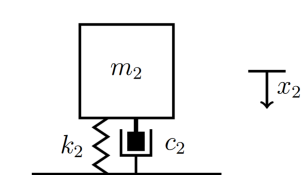
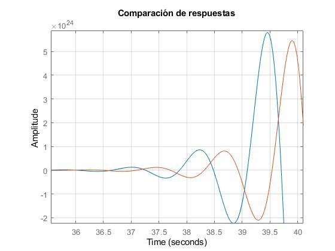

```{r setup, include=FALSE}
knitr::opts_chunk$set(echo = TRUE, fig.align="center")
```

\newcommand{\bcenter}{\begin{center}}
\newcommand{\ecenter}{\end{center}}

\bcenter
# Proyecto final de Ecuaciones Diferenciales Ordinarias: 
# Amoritiguadores de masa sintonizados
\ecenter

## **Introducción**
Los amortiguadores de masa sintonizada son masas vibrantes que se mueven fuera de fase con el movimiento de alguna estructura en la que se está suspendida, generalmente se instalan en la parte superior de los edificios y que al estar en sintonía con la frecuencia de movimiento del edificio funcionan como un contrapeso que oscila y contrarresta el movimiento del edificio disipando la energía de un terremoto o del viento.  
Esta no es la única aplicación práctica que tienen, también pueden ser usados en mesas de cirugía para evitar el movimiento de estas durante una intervención quirurjica de alta precisión.   
La eficacia de disipación de energía de un TMD depende de la precisión de su sintonía, el tamaño de su masa en comparación con la masa modal de su modo objetivo, es decir, su relación de masa, y la extensión de la amortiguación interna incorporada en el amortiguador de masa sintonizado.  
Básicamente, uno puede pensar en un TMD como un contrapeso mecánico para una estructura que consta de una masa en movimiento (aproximadamente 1 a 2% de la masa de la estructura). 

**Modelado de un amortiguador de masa sintonizado**  
Representamos la rigidez de la masa original de un sistema usando un resorte y la absorción de energía usando un amortiguador. Adjuntaremos un resorte y un amortiguador (TMD) a la masa original y exploraremos qué tanto se puede reducir las vibraciones debidas a fuerzas externas. Se caracterizará el desplazamiento de la masa sobre una posición de equilibrio inicial por un solo grado de libertad. Sin embargo, en el caso del TMD, agregaremos una segunda masa y un resorte a la masa primaria. El desplazamiento de la masa TMD se caracterizará por un grado separado de libertad sobre su propia posición de equilibrio inicial. Por lo tanto, un TMD es un par de osciladores armónicos amortiguados acoplados.  
Una gran masa $m_1$ en un "resorte" con constante de resorte $k_1$ se acopla a una masa más pequeña $m_2$ por un resorte con constante de resorte $k_2$ y un amortiguador con coeficiente de amortiguación $c_2$. La gran masa también podría estar naturalmente amortiguada con un coeficiente de amortiguación o de restauración $c_1$. Para nuestro estudio, tomamos $c_1 = 0$ y $c_2 = 0$. Es decir, supondremos que no hay resistencia ni amortiguamiento de la masa original o del TMD. Al ajustar los valores de $m_2$ y $k_2$ la amplitud máxima de las oscilaciones de $m_1$ se puede reducir.  
En este caso sin resistencia ($c_1 = 0$ y $c_2 = 0$) cuando aplicamos una carga externa o fuerza impulsora, $f(t)$, tenemos el siguiente modelo de ecuación diferencial de un solo grado de libertad para el desplazamiento, $y(t)$, de nuestra masa desde su equilibrio estático, es decir, un sistema de resorte-masa (sin salpicadero):
$$my''(t) + ky(t) = f(t), \ (1) \\y(0)=y_0, \\ y'(0) = v_0; $$
La frecuencia natural de masa $m_1$ se puede obtener de la solución de la porción homogénea,(2), de nuestra ecuación diferencial (1),

$$ my''(t) + ky(t) = 0, \ (2) \\ y(0)=y_0, \\  y'(0) = v_0; $$  
De (3) vemos que la frecuencia natural de la solución no impulsada u homogénea de (2) es $\omega_0=\sqrt\frac{k}{m}$ mientras que la solución homogénea completa para (1) es:  
$$ y(t)= \frac {v_0 \sqrt m \sin(\sqrt \frac {k}{m}t)+y_0 \sqrt k \cos(\sqrt \frac {k}{m} t)}{\sqrt k}, \ (3) $$  
Recuerde lo que sucede si la función del controlador $f(t)$ tiene la misma frecuencia que la frecuencia natural, del sistema resorte-masa - RESONANCIA y problema. Para ver ésto dividimos ambos lados de (1) por $ m $ y reordene la ecuación resultante usando $$ t \omega^2_0 = \frac{k}{m} $$ para obtener (4):
$$ y''(t) + \omega^2_0 \space y(t) = \frac{1}{m} f(t), \ (4) \\ y(0) = y_0,  \\ y'(0)= v_0 $$
Ahora, si $f(t) = \sin ( \omega t)$ y este controlador tiene la misma frecuencia natural que nuestro sistema de masas, es decir, $\omega = \omega_0$ , entonces nuestra solución de (4) es:
$$y(t) = - \frac {t \cos( \omega t)}{2m \omega_0}+ \frac { \sin( \omega_0 t)}{2m \omega^2_0} - \frac{ \sin( \omega_0 t) \cos^2( \omega_o t)}{2m\omega^2_0} + \frac { \sin(2 \omega_0 t) \cos( \omega t)}{4m \omega^2_0} + \frac{ v_0 \sin( \omega_0 t)}{ \omega_0}+ y_0 \cos( \omega_0 t ), \ (5)$$
El término clave en esta solución es el primer término. Todos los demás términos son del periodo $\frac{2 \pi}{m}$ con amplitudes finitas. El primer término $\frac {-t \cos ( \omega_0 t)}{2 \omega_0}$ crece sin límite y en consecuencia nos referimos a este fenómeno de solución como resonancia. Para los siguientes valores, $\omega_0 = 1$, $y_0 = 2$, $v_0 = 0$ y $m = 1$ se grafique nuestra solución (5) sobre el intervalo de tiempo [0, 100] en la Figura 1 y observe que la solución crece indefinidamente; esto es resonancia.

```{r}

```


### *Actividad 1*
Usando la Segunda Ley de Newton, que dice que la masa multiplicada por la aceleración de esa masa es igual a la suma de todas las fuerzas externas que actúan sobre la masa, y la Figura 4 como fuente del Diagrama de cuerpo libre,muestran que las ecuaciones que gobiernan los movimientos de la estructura y el amortiguador están dadas por:

$$ m_1 \space x''_1(t) = -k_1 x_1(t)- c_1x'_1(t)-k_2(x_1(t)-x_2(t))-c_2(x'_1(t)-x'_2(t))+p_0 \space cos(\omega t), \space\space\space\space (1)$$
$$ m_2 \space x''_2(t) = -k_2(x_2(t)-x_1(t))-c_2(x'_2(t)-x'_1(t)), \space\space\space\space (2) $$

Observando el diagrama del TMD, notamos que podemos dividir en las dos masas junto con sus componentes aledaños.  

{width=30% height=30%}

La ecuación (1) se describe dividiendo el sistema:   
{width=30% height=30%}  
$$F_0m_1 + F_1c_1+F_2k_1+F_3k_2+F_4c_2=P_0 \cos( \omega t)$$
Puesto que $x(t)$ está en unidades de fuerza, sustituímos las diferentes formulas y obtenemos (1)  
La ecuación (2) se da mediante el siguiente diagrama:  
{width=30% height=30%}  
$$F_0m_2 +F_2k_2+F_3c_2=0$$
Por lo tanto las ecuaciones iniciales se dan mediante la 2da ley de Newton, sustituendo la suma de todas las fuerzas. 


### *Actividad 2*
a) Determine la forma de las ecuaciones de la actividad anterior cuando $c_1 = 0$ y $c_2 = 0$.  
$$ m_1 \space x''_1(t) = -k_1 x_1(t)-k_2(x_1(t)-x_2(t))+p_0 \space cos(\omega t), \space\space\space\space (1^*)$$
$$ m_2 \space x''_2(t) = -k_2(x_2(t)-x_1(t)), \space\space\space\space (2^*) $$

b) En el sistema resultante use $m_1 = 10$ y $k_1 = 90$ con $y(0) = 0$ y $y''(0) = 0$, mientras que $f(t) =10 \space\space \cos (3t)$ y establezca $m_2 = 1$ con $k_2 = 0$, es decir, retirando el segundo sistema de masas. Explique los resultados de importancia física e impacto de los números 10, 90 y 3 en la oración anterior en términos del movimiento del oscilador inicial.  
$$ 10 \space x''_1(t) = -90 x_1(t))+10 \space cos(3t)$$  
$$ \space x''_2(t) = -x_1(t))  $$
Los valores de las variables del sistma nos proveen de información útil para interpretar nuestras ecuaciones. El valor de $k_2=0$ elimina por completo la constante del resorte quedándonos solamente con la fuerza aplicada a la estructura. El valor $m_1 = 10$ en contraste con $m_2 = 1$ nos indica que $m_2$ es el 10% de $m_1$. Esto es una relación de masa un poco exagerado en términos prácticos. El valor $k_1 = 90$ nos indica una constante alta que indica que requerirá una fuerza mayor para mover la masa. El valor de $\omega = 3$ nos indica que $k= 9m $ Es decir que la frecuencia natural da como resultado 3. 

c) Resuelva la ecuacion diferencial simple resultante para el movimiento de la masa $m_1$ durante un intervalo de tiempo de 20 unidades y grafique el desplazamiento de esa masa, $x_1(t)$, durante ese intervalo de tiempo. Explique las observaciones. 
*Cálculos:*  
<https://drive.google.com/file/d/1IIkrJmsNC-0gljtXQ_LOO4ae-1JUD1a6/view?usp=sharing>  

<https://drive.google.com/file/d/1IZ9YWFgteNLFU6vdUNTTepDHn0TNbrJn/view?usp=sharing>
  

d) En las ecuaciones de la actividad anterior use los valores $m_1=10$ y $k_1=90$ con $y(0)=0$ y $y'(0)=0$ mientras $f(t)=10 \space\space \cos (3t)$ y establezca $m_2=1$ con valores variables de $k_2$. Mantenga $c_1=0$ y $c_2=0$. ¿Qué observa en la amplitud máxima de la masa inicial $m_1$ cuando se cambia $k_2$?  

A medida que $k_2$ aumenta, la amplitud máxima de $m_1$ disminuye.

{width=30% height=30%}
{width=30% height=30%}
{width=30% height=30%}
{width=30% height=30%}
{width=30% height=30%}
{width=30% height=30%}

e) De (d) ¿cuál es el "mejor" valor de $k_2$?  
Un valor más alto en k disminuye el el tiempo de respuesta y las oscilaciones de la mása más grande. Por lo tanto el valor para la constante del resorte $k_2=10,000$ es el mejor valor.  

f) Para obtener el mejor valor de $k_2$, determine el desplazamiento de amplitud máximo para la masa $m_1 ,\space\space x_1 (t)$ en un rango de frecuencias  

### *Actividad 3*
Consideremos otra configuración comparable a la Actividad 2 para la práctica. Observe que la masa $m_2$ es solo el 1% de la masa $m_1$, lo cual es bastante realista en el diseño estructural cuando se utilizan TMD.
a) Determine la forma de las ecuaciones de la actividad anterior cuando $c_1 = 0$ y $c_2 = 0$
b) En el sistema resultante use $m_1 = 10$ y $k_1 = 90$ con $y(0) = 0$ y $y'(0) = 0$ mientras $f(t) =10 \space\space \cos (3t)$ y ajuste $m_2 = 0.1$ con $k_2 = 0$, es decir, retire el segundo sistema de masa. Explique la importancia física e impacto de los números 10, 90 y 3 en la oración anterior en términos del movimiento del oscilador inicial.
c) Resuelva la ecuación diferencial simple resultante para el movimiento de la masa $m_1$ durante un intervalo de tiempo de 20 unidades y grafique el desplazamiento de esa masa, $x_1 (t)$, durante ese intervalo de tiempo. Explique las observaciones.  


d) En las ecuaciones de la actividad anterior use los valores $m_1=10$ y $k_1=90$ con $y(0)=0$ y $y'(0)=0$ mientras $f(t)=5 \space\space \cos (3t)$ y establezca $m_2=0.1$ con valores variables de $k_2$. Mantenga $c_1=0$ y $c_2=0$. ¿Qué observa en la amplitud máxima de la masa inicial $m_1$ cuando se cambia $k_2$?  
A medida que $k_2$ aumenta, la amplitud máxima de $m_1$ disminuye.

{width=30% height=30%}
{width=30% height=30%}
{width=30% height=30%}
{width=30% height=30%}
{width=30% height=30%}
{width=30% height=30%}


e) De (d) ¿cuál es el "mejor" valor de $k_2$? 
Un valor más alto en k disminuye el el tiempo de respuesta y las oscilaciones de la mása más grande. Por lo tanto el valor para la constante del resorte $k_2=10,000$ es el mejor valor.
 
f) Para obtener el mejor valor de $k_2$, determine el desplazamiento de amplitud máximo para la masa $m_1 ,\space\space x_1 (t)$en un rango de frecuencias  

### *Actividad 4*
Del material introductorio para este escenario ofrecido anteriormente y los análisis en las Actividades 2 y 3 realiza una descripción de cómo construir un TMD para detener los fenómenos de resonancia en el caso de las siguientes ecuaciones, que son el caso de las ecuaciones de la actividad 1 donde no hay amortiguamiento, es decir, $c_1 = 0$ y $c_2 = 0$:
$$ m_1 \space x''_1(t) = -k_1 x_1(t)-k_2(x_1(t)-x_2(t))+p_0 \space cos(\omega t), \space\space\space\space (1)$$
$$ m_2 \space x''_2(t) = -k_2(x_2(t)-x_1(t)), \space\space\space\space (2) $$  
*Cálculos:* 
<https://drive.google.com/file/d/1hOhWC6mFchmd_5QtLWcilslzbOfT_JI1/view?usp=sharing>